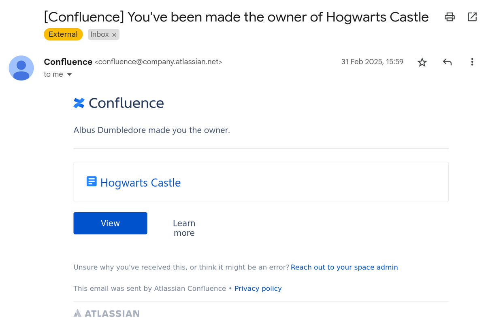
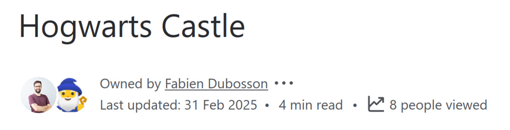
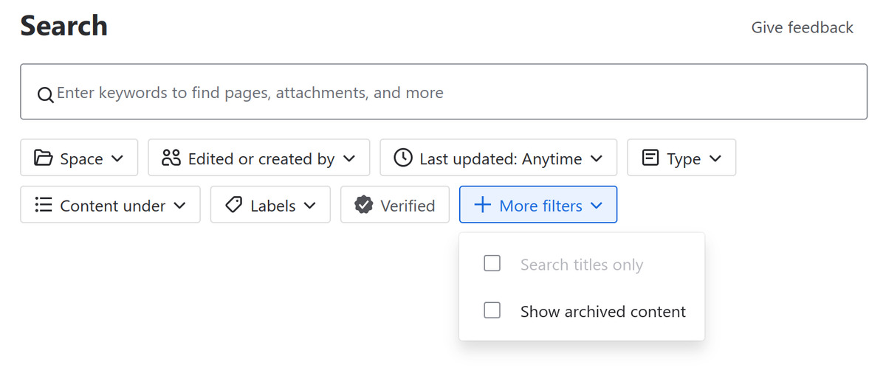
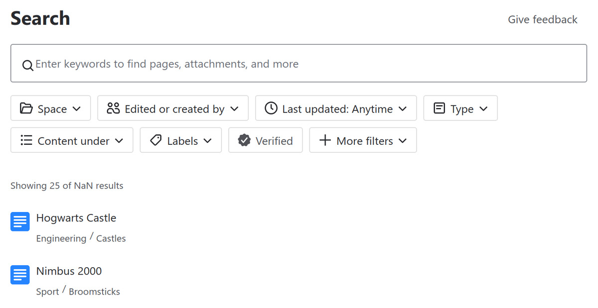
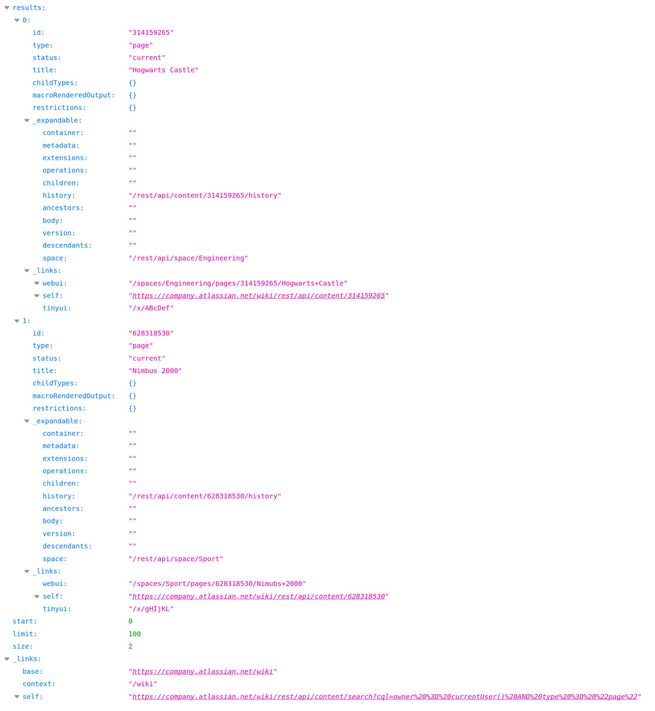

## A Question of Ownership

If your company uses Atlassian products, especially Confluence, you’ve probably received an email like this at some point:

<figure>
  
  <figcaption>Example email from Confluence informing you that you have been made the owner of a page</figcaption>
</figure>

Congratulations, you’ve just been made the owner of a Confluence page. From now on, anyone viewing the page will see your name at the top:

<figure>
  
  <figcaption>Header of a Confluence page showing the owner</figcaption>
</figure>

That’s probably not the first page you own. In fact, any page you create is automatically owned by you, so you’re likely the proud owner of more pages than you realize.

Naturally, that got me wondering: what Confluence pages do I own? There are a few good reasons to ask this:
- Plain curiosity
- Cleaning up stale or forgotten content
- Transferring ownership of pages I’m no longer responsible for
- Keeping the content updated: if my name’s on it, I should probably maintain it

Then comes the inevitable thought: “Oh no… Confluence search.” If you’ve used it, you know. If it works great for you, please tell me your secrets.

Anyway, I gave it a shot:

<figure>
  
  <figcaption>Filters available in Confluence search</figcaption>
</figure>

No luck. There’s no way to filter by "owner." The "Created or Edited by" filter is too broad: I may own pages I never created or edited, and there are many more pages that I have created or edited than I actually own.

Time to dig deeper.

## Enter CQL: Confluence Query Language

After some web searching, I stumbled upon this [community post](https://community.atlassian.com/forums/Confluence-questions/How-do-I-find-all-pages-by-owner/qaq-p/2743993), where someone mentioned CQL, Confluence’s equivalent of Jira’s JQL. First good bit of information: there is a way to search for pages you own through a CQL query:

```
owner = currentUser()
```

Now the accepted answer? You can use CQL… but not through the regular UI, unless you install a third-party app.

No, thanks.

But now I’m curious: how hard is it to use CQL without the app? Turns out, not very. This older [article](https://community.atlassian.com/forums/Confluence-articles/Useful-CQL-statements-to-search-what-you-need-in-Confluence/ba-p/1769849) shows that you can run CQL by constructing the URL manually like this:

```
https://<confluence-base-url>/dosearchsite.action?cql=<CQL in the example below>.
```

Wait, is it really that easy? No need for a third-party app to run a CQL query? Let’s try it out using the query above through the following URL:

```
https://company.atlassian.net/wiki/dosearchsite.action?cql=owner %3D currentUser()
```

It works!

<figure>
  
  <figcaption>First results of a Confluence search for pages that you own using CQL</figcaption>
</figure>

It shows the first 25 results of… `NaN`. It seems that indexing might not be straightforward with CQL queries, so we can overlook this minor issue.

The search field is also left blank, but the query is visible in the address bar:

<figure>
  
  <figcaption>The query is only visible in the address bar</figcaption>
</figure>

Even better: the request redirected to the normal search URL, so you can simply append `?cql=…` to the URL when you are on the search page to run a CQL search. Convenient!

## Trimming Results

Coming back to my realm, here’s what I want to search for:

- Pages
- That I own
- That are **not** in my space (because I already know I own what’s there).

The corresponding CQL query is:

```
owner = currentUser() AND type = "page" AND space.key != "~XXX"
```

Your browser should automatically encode the equal sign as `%3D`, but if that’s not the case, you can do it manually.

To find your personal space key, just open your space and look at the URL: it’s usually something like `~username`, which can also be composed only of digits if it hasn’t been named.

There’s even proper documentation for the [CQL advanced search](https://developer.atlassian.com/server/confluence/advanced-searching-using-cql/) functionality. I haven’t read it, but depending on what you may want to do, you might find your answers there.

## Bonus: The REST API

Someone in the thread also mentioned you can query CQL via a REST API. The URL differs slightly:

```
https://company.atlassian.net/wiki/rest/api/content/search?cql=…
```

My first reaction: meh, not in the mood to deal with API keys.

But I tried the modified URL and, to my surprise, it worked with my browser session. A clean JSON response popped up:

<figure>
  
  <figcaption>The REST API providing the pages you own in JSON format</figcaption>
</figure>

I’m not building a production service here, so copy-pasting the JSON into an editor to do some scripting locally works just fine for my needs. I don’t need to find a way to integrate with the API and its permissions.

## Wrapping Up

So there you have it. With a little CQL magic and a custom search URL, you can easily find all the Confluence pages you own—your Confluence realm.

```
https://company.atlassian.net/wiki/search?cql=owner %3D currentUser() AND type %3D "page"
```

Replace `company` with your Atlassian domain, and you’re good to go. If you want to go the extra step of filtering your own space, you can add `AND space.key != "~XXX"` (see [reference above](#trimming-results)). And if there are too many pages, you can get them as JSON as explained [here](#bonus-the-rest-api).

Now, if you’ll excuse me, I’ve got 68 pages to take care of.

Happy exploring 👑
