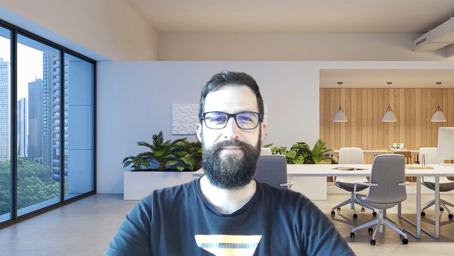
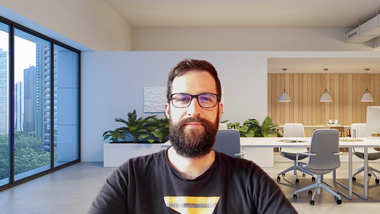

If there is one change that Linux users fear the most, it's switching to a brand new laptop. Even though hardware support is much better than when I first started 25 years ago, it is still a gamble to know if you picked one that will get all functionalities supported.

If you ever tried installing Linux on a Pentium 4 with a blurry CRT, you’ll remember the joy and pain of hardware compatibility (and maybe Compiz cubes). Some things haven’t changed.

Nowadays, the main hardware troubles on Linux come from the webcam. New generation laptops come with MIPI webcams for which Linux support [is lacking][], to say the least. Fully aware of this fact, I managed to order a laptop that has a good old USB webcam that has a better chance of being supported on Linux — it's more challenging than it sounds. For the curious out there, it's a [Lenovo ThinkPad X1 Carbon Gen 13][], but be warned, it is sold with both types of cameras.

[is lacking]: https://www.phoronix.com/news/Greg-KH-No-ADL-Webcam-Laptop
[Lenovo ThinkPad X1 Carbon Gen 13]: https://www.lenovo.com/ch/en/p/laptops/thinkpad/thinkpadx1/thinkpad-x1-carbon-gen-13-aura-edition-14-inch-intel/len101t0114

After several evenings and weekend days installing and configuring Linux (sounds like a lot? May I introduce you to Arch Linux?) I finally got to the webcam test 🥁 … and it worked!

<figure>
  
  <figcaption>Image of the webcam with default settings, including automatic white balance</figcaption>
</figure>

When I'm in meetings, I usually use the background seen above. The webcam worked, but I look rather pale in this picture. Not super pleasant for others, and not radiating a positive image. Webcam support is there, but it's not the out-of-the-box MacOS experience, for sure. That's the advantage when you control both the software and the hardware.

The downside of Linux is also one of its strengths: hackability. A few messages to ChatGPT later, I found out the command that shows the camera settings:

```
$ v4l2-ctl --list-ctrls

User Controls

                     brightness 0x00980900 (int)    : min=0 max=255 step=1 default=128 value=128 flags=has-min-max
                       contrast 0x00980901 (int)    : min=0 max=100 step=1 default=32 value=32 flags=has-min-max
                     saturation 0x00980902 (int)    : min=0 max=100 step=1 default=64 value=64 flags=has-min-max
                            hue 0x00980903 (int)    : min=-180 max=180 step=1 default=0 value=0 flags=has-min-max
        white_balance_automatic 0x0098090c (bool)   : default=1 value=1
                          gamma 0x00980910 (int)    : min=90 max=150 step=1 default=120 value=120 flags=has-min-max
           power_line_frequency 0x00980918 (menu)   : min=0 max=2 default=1 value=1 (50 Hz)
      white_balance_temperature 0x0098091a (int)    : min=2800 max=6500 step=10 default=4600 value=4600 flags=inactive, has-min-max
                      sharpness 0x0098091b (int)    : min=0 max=7 step=1 default=3 value=3 flags=has-min-max
         backlight_compensation 0x0098091c (int)    : min=0 max=2 step=1 default=1 value=1 flags=has-min-max
   region_of_interest_rectangle 0x00981ae1 (rect)   : value=(0,0)/1x1 flags=has-payload, has-min-max
  region_of_interest_auto_ctrls 0x00981ae2 (bitmask): max=0x00000001 default=0x00000001 value=0 flags=has-min-max

Camera Controls

                  auto_exposure 0x009a0901 (menu)   : min=0 max=3 default=3 value=3 (Aperture Priority Mode)
         exposure_time_absolute 0x009a0902 (int)    : min=2 max=1250 step=1 default=156 value=156 flags=inactive, has-min-max
     exposure_dynamic_framerate 0x009a0903 (bool)   : default=0 value=1
                        privacy 0x009a0910 (bool)   : default=0 value=0 flags=read-only
```

This may look intimidating at first, but brightness, contrast, saturation, hue, white balance temperature, sharpness... that's all familiar from photo editing! So I started by disabling automatic white balance — which, on this hardware at least, seems to make things worse — and began playing around with other parameters.

I spent a while tweaking brightness, contrast, and white balance settings, running dozens of variations until I hit something that I liked. Those numbers ended up in a script that runs at startup to set up the webcam, so I can finally look like a living human:

```bash
i_am_a_living_creature_fix_the_webcam___please() {
    v4l2-ctl -c brightness=97
    v4l2-ctl -c contrast=29
    v4l2-ctl -c saturation=64
    v4l2-ctl -c white_balance_automatic=0
    v4l2-ctl -c white_balance_temperature=4100
    v4l2-ctl -c sharpness=7
    echo "Applied favorite webcam configuration."
}
```

We probably won't all agree on the best configuration, but I think we can all agree that this version looks much better than the default one:

<figure>
  
  <figcaption>Image of the webcam after fine-tuning webcam settings manually</figcaption>
</figure>

Let me know you have any suggestions to improve my appearance. And no, shaving the beard is not an option 😜


  **Update 2025-08-15**: A colleague pointed out that automatic white balance is often unreliable in wooden environments, such as mountain cabins, which was my setting when writing this article. The automatic white balance works much better in typical home or office settings. That said, the solutions described above remain useful when working in wooden spaces.

