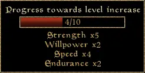
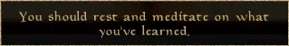
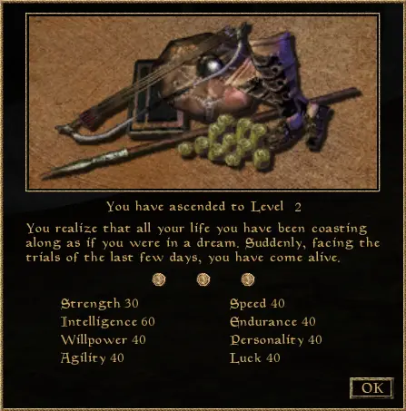

I don't know about you, but I always feel different when coming back to work after the end-of-year holidays. Not just rested, but also with a different mindset. One year ago, I told my engineering manager that I needed rest to level up, like in the game _Morrowind_. Seeing his face made me realize that [The Elder Scrolls III: Morrowind][] may not be such a well-known reference as I thought[^1].

[The Elder Scrolls III: Morrowind]: https://en.wikipedia.org/wiki/The_Elder_Scrolls_III:_Morrowind

In tech, we spend most of the year with our heads down, focusing on execution. Doing so, we are constantly learning and accumulating experiences. We develop new skills, like sharper prioritization, clearer communication, or better technical judgment. We take on new responsibilities and build more context. But we rarely take the time to stop and synthesize what we have learned. We are busy progressing, but not clearly "leveling up".

That's where I made the connection with Morrowind. When starting a new adventure in Morrowind, you choose a character that has some initial characteristics, like the screenshot[^2] below:

<figure>
  
  <figcaption>Your Morrowind character attributes and skills</figcaption>
</figure>

If it looks complex, rest assured we don't need to dive into the full mechanics of the game. Instead, let's focus on the "Level" of our character. The way it increases is by doing actions in the game, like moving, fighting, or even reading books. Those actions develop skills, which in turn contribute to leveling up.

Once you have developed enough skills, you are ready to move to the next level. The screenshot below is an example of such progress:

<figure>
  
  <figcaption>Morrowind tracks developed skills</figcaption>
</figure>

The level-up isn't triggered by actions; **rest triggers it**. Once you're ready, the game tells you, "You should rest and meditate on what you've learned."

<figure>
  
  <figcaption>Morrowind suggests resting to level up</figcaption>
</figure>

And once you do so, the level-up screen wakes your character up and lets you pick three attributes you want to develop.

<figure>
  
  <figcaption>Morrowind level-up screen</figcaption>
</figure>

I believe there is a direct parallel with real life. When we have our heads down, focusing on execution, we develop skills. But those don't really compound together until we take time to rest and level up.

While in Morrowind taking a nap is enough to trigger a level up, in real life we need holidays. Longer breaks create the space to let things settle down. And the magic is that it does not require a formal process nor a structured retrospective. Letting our brains wander naturally and connect the dots subconsciously is often enough.

We assimilate what happened during the year, how challenges were handled, what we learned, and everything else we went through. The level-up happens almost accidentally.

The way it materializes for me is that I come back from holidays with a clearer understanding of my role, a better perspective on responsibilities, and more confidence and calm. This is often the moment when I also realize any increase in influence or leadership.

Leveling up doesn't always require effort; sometimes all we need is a holiday.

[^1]: Even though people are still actively developing and maintaining a [modern engine](https://openmw.org/) to play the game 24 years after its release.
[^2]: Did I reinstall the game to make the screenshots? Yes. Did I do it for the blog post or for the nostalgia? Both ;)
