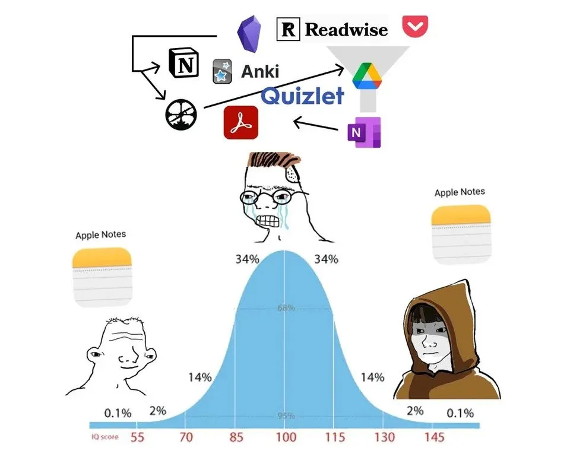

Starting a blog has been in the back of my mind for more than 15 years. And to be honest, this website is far from my first attempt at building one. I believe I’m not the only engineer who has faced this problem, so in this post, I reflect on what finally made publishing this first article possible for me.

## The past

All my previous blogging attempts started the same way: I would read someone’s article and think, “This is great, I want to do the same!” And, as a software developer, my first thought would always be, “Of course, I’ll develop my own website.” After all, who wouldn’t want to create amazing interactive articles like those by [Bartosz Ciechanowski][]?

Days go by, spent picking a name, setting up automation, designing the interface, spending hours aligning boxes pixel-perfect, deciding on image border radii, and creating color palettes. Eventually, a draft of the website gets deployed. But it’s an empty shell—it contains no content.

If other people were successful at producing articles, it surely meant they were working harder than me, didn’t it? I must be procrastinating. So, I worked late into the night, further improving the website with keyboard shortcuts and fancy CSS animations. But alas, no content ever saw the light of day.

The motivation to work on these projects eventually fades, and they end up in limbo. These setbacks reinforced the idea that writing wasn’t meant for me, or at the very least, that I wasn’t good at it.

## The problem

I felt comfortable working on these technical aspects though… was I afraid to write and publish actual content? My last blogging attempt was about five years ago, and since then, I’ve developed the habit of reading. One article made me realize that I had a procrastination problem—but not due to laziness. It was a procrastination problem linked to perfectionism, rooted in emotions:

> One reason why people procrastinate is perfectionism. For example, perfectionistic students might be so critical of themselves for making mistakes in school assignments, that they will postpone doing homework to avoid dealing with the associated negative emotions. Similarly, perfectionistic writers might be so worried about their book being criticized, that they will delay sending the book for feedback. — [Itamar Shatz][]

This reading was enlightening because it revealed a potential root cause of my previous failures. Exposing my ideas was definitely outside my comfort zone back then. Confronting your thoughts with the world is stressful—it opens you up to criticism. To protect myself, I wanted my articles to be perfect. As a result, even when I managed to start drafting articles, they never made it to the website because they were never good enough.

A second layer of perfectionism was hidden in there. Even if I procrastinated on producing content, nothing was forcing me to nitpick over every detail of the website. I wanted to make the form perfect as well. This wasn’t driven by negative emotions, as it was with the content, but rather by the positive emotions that came from the satisfaction of building something great.

## The observation

While great form can aid the reader, the most important part is the content itself. I’ve noticed that smart people sometimes have simple websites and that insightful content doesn’t require a fancy interface. Two examples of such websites come to mind, in no particular order and without any specific significance: John Walker, founder of Autodesk Inc., and his [fourmilab.ch][] website, and Paul Graham, co-founder of Hacker News, with his essays on [paulgraham.com][].

Speaking of Hacker News, I also believe it falls into the "focus on the content, not on the form" category. Despite some valid criticism, it is a great example of a platform for civilized and insightful discussions. All of this happens on a website with no images, no emojis, and almost no markup—just text.

These examples of content versus form remind me of the following [note-taking meme][]. This meme suggests that people in the normal IQ range use a complex setup to take notes—such as Notion, OneNote, Readwise, and Pocket—while people with low IQ simply use Apple Notes. The irony of the meme is that people with higher IQ also simply use Apple Notes. I interpret this to mean that people with high IQ focus on the content, not the form.

<figure>
  
  <figcaption>A classical note-taking meme</figcaption>
</figure>

While I wouldn’t dare to compare myself to the people mentioned above, I can certainly take inspiration from them if I want to progress and try moving to the right of the normal curve. In fact, it would be easy to create a variant of this meme for blogging. It might look something like the one below. It’s, of course, an exaggeration—but isn’t that the point of a meme after all?

<figure>
  
  <figcaption>An adaptation of the classical note-taking meme to blogging</figcaption>
</figure>

So, if I were to give blogging another try, I would need to imitate smart people and opt for simple tools that allow me to focus on the content rather than getting distracted by the form.

## The present

Some recent reading [^1] [^2] [^3] on the topic of writing has changed my perception of the act itself. Writing is not just a way to share and communicate knowledge; it is also a powerful tool for developing your thinking. Over the past year, I started writing for myself and have come to truly appreciate its value.

> It is like training for your thinking, it makes you more powerful which translates to better understanding and greater insight. Blogging is less popular now than it was but don’t let that stop you, in the end the person that benefits most, even if few people read it, is you.
> — [Jack Vanlightly][]

Writing for myself is undoubtedly useful, but without the pressure of public scrutiny, the temptation to take shortcuts becomes all too strong. If I truly want to develop and challenge my thinking, I need to publish my articles. The two weeks of end-of-year holidays provided the perfect opportunity to work on this, so I set myself the challenge of building a website and publishing my first blog article during this time—while enjoying the holidays as well, of course. Challenge accepted.

To move towards the right side of the normal curve, I chose existing, simple tools that would help me avoid the pitfalls of perfectionism. I selected [Hugo][] as the static site generator and [GitHub Pages][] for hosting. There’s nothing more standard than that for a tech blog of this kind, but that also means these are proven technologies. Finally, the topic for the first article was all found: Overcoming Perfectionism.

Armed with an understanding of the root cause of my procrastination, I found it easy to notice when I started avoiding work on the content—because I would be doing, quite literally, anything else. The time constraint was also a great help, as it prevented me from going too far with nitpicking the form.

## The finale

As expected, writing this first article forced me to organize my thoughts and allowed me to identify two key actions that helped me succeed this time:

- Setting a soft deadline to prevent nitpicking perfectionism
- Observing my behavior to recognize when my emotions are distracting me from the main task

These are the lessons I’ll carry with me for my future writings and projects. And maybe they’ll also strike a chord with you?

Well, it’s now time for me to overcome my perfectionism and push this imperfect article to GitHub to share it with the world.

Happy reading!

[Bartosz Ciechanowski]: https://ciechanow.ski/archives/
[Itamar Shatz]: https://solvingprocrastination.com/perfectionism/
[fourmilab.ch]: https://www.fourmilab.ch/
[paulgraham.com]: https://paulgraham.com/articles.html
[note-taking meme]: https://madmaddox.medium.com/this-meme-perfectly-illustrates-the-road-to-mastery-c97314ff6ad2
[Jack Vanlightly]: https://jack-vanlightly.com/blog/2022/1/25/write-for-others-but-mostly-for-yourself
[Hugo]: https://gohugo.io/
[GitHub Pages]: https://pages.github.com/

[^1]: https://rmoff.net/2023/07/19/blog-writing-for-developers/
[^2]: https://www.henrikkarlsson.xyz/p/writing-to-think
[^3]: https://jack-vanlightly.com/blog/2022/1/25/write-for-others-but-mostly-for-yourself
