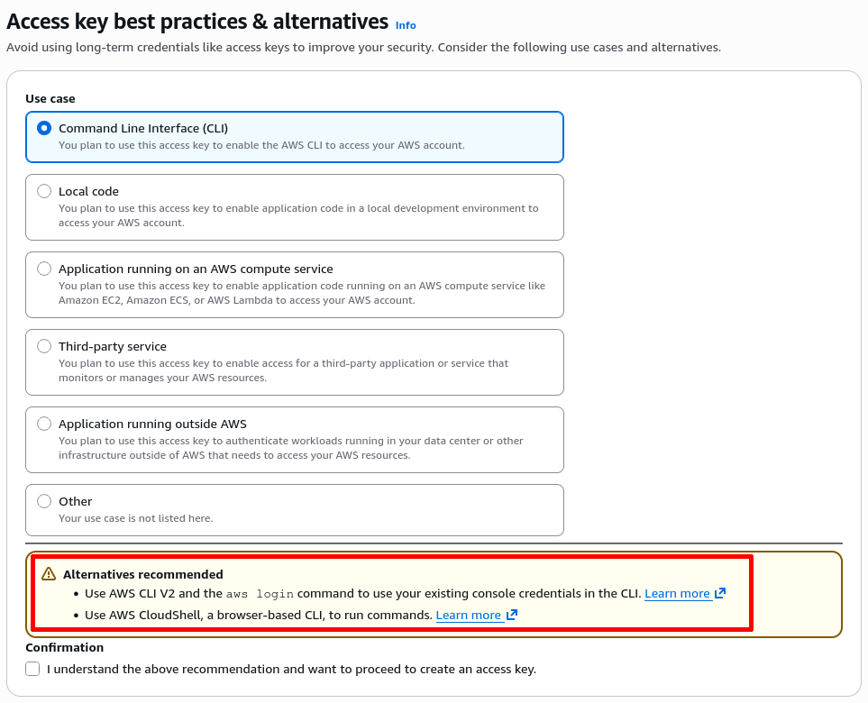

## Introduction

Whenever I have to store an AWS access key on my machine, I'm always concerned about setting it up in clear text in my home folder. Even though I have LUKS encryption protecting my filesystem when the laptop is off, it is most of the time either running or suspended, which means the filesystem is accessible.

If my laptop is stolen while suspended, there is a small chance that an attacker would figure out a way to access the data. Such a scenario is more likely to come from a **targeted attack** though, as a simple theft would result in someone formatting the laptop and selling it for the hardware money. And as we all know there are [much simpler ways to do targeted attacks](https://xkcd.com/538/) anyway. So I'm going to ignore this threat model in this article.

I'm more concerned about all the time my laptop is running. With AWS credentials stored in clear text and in a known location (`~/.aws/credentials`), most processes can easily read them, which means a vulnerability in any single piece of code running on my machine can compromise those keys. This opens a much larger surface for **opportunistic attacks**, such as we have seen recently with [Shai-Hulud](https://www.wiz.io/blog/shai-hulud-2-0-ongoing-supply-chain-attack#:~:text=Credential%20Harvesting%3A%20It%20scrapes%20credentials%20from%20local%20configuration%20files%20(e.g.%2C%20~/.aws/credentials%2C%20~/.azure/)%2C%20environment%20variables%2C%20and%20internal%20cloud%20metadata%20services%20(IMDS)%20to%20steal%20temporary%20session%20tokens.).

While storing AWS access keys GPG encrypted is not a bulletproof solution to all security risks, it is nonetheless a welcome additional layer of security. This can be the difference between being the victim of an opportunistic attack or not. It protects the credentials at rest; once they are decrypted, any process that can read them can still misuse them.

In this post, I'll guide you through a low-friction way to store your access keys encrypted. The method uses GPG for credentials encryption, the `credential_process` AWS configuration, and a bash script to act as a wrapper between the two.

### AWS-recommended solutions

Before we get started, please note that AWS is encouraging alternatives to access keys for the command line interface (CLI) and other use cases. If you can follow the suggested approaches, you should likely go with those.

<figure>
  
  <figcaption>Recommended alternatives to access keys for CLI</figcaption>
</figure>

There are, however, situations where you don't have a choice, and you have to resort to using access keys. In such cases, the AWS wizard recommends **never storing credentials in plain text:**

<figure>
  
  <figcaption>AWS recommendations regarding access keys</figcaption>
</figure>

I haven't heard yet about an official way to store access keys encrypted, at least not on Linux. It's of course possible to script your way through, but that usually adds extra friction in the process: running extra commands before usage, remembering to clean up after usage, etc. In the past I've used [aws-vault](https://github.com/99designs/aws-vault/) for this, but the project [looks abandoned now](https://github.com/99designs/aws-vault/issues/1269).

This article is for such cases, where:
- you have to use access keys;
- you want to store them encrypted; and
- you want to keep the process low-friction.

If that's what you need, please keep reading!

## Encrypting your AWS access keys

Let's start with a simple setup to build a mental model of how it works. Later we will extend it to more advanced use cases, but the building blocks will stay the same.

The high-level process is the following:
1. Put the credentials in a GPG-encrypted file
2. Create a wrapper script that decrypts the file and returns it in the right format
3. Configure AWS to use this wrapper script to obtain credentials


This blog post assumes you already use [GPG](https://www.gnupg.org/). If that's not the case, you can find tutorials online, like for instance this [blog post from Red Hat](https://www.redhat.com/en/blog/getting-started-gpg).

If you don't want to use GPG, the approach presented in this blog post can [easily be adapted](#using-something-other-than-gpg-to-secure-the-credentials) to use other tools that manage credentials, such as the OS keyring or an external service like Bitwarden.


### 1. Put the credentials in a GPG-encrypted file

We start by putting the credentials in a GPG-encrypted file.

```ini
AWS_ACCESS_KEY_ID="..."
AWS_SECRET_ACCESS_KEY="..."
```

Personally, I have placed this in `.aws/credentials.gpg`. This is not a special file, and it is not supported by AWS. But if we are not going to have a `.aws/credentials` file, placing it there makes it discoverable and easy to understand that credentials are stored there, but GPG encrypted.

Don't forget to get rid of the `.aws/credentials` file once your new setup is finalized, there is no point in storing your credentials encrypted if they are still available in the clear somewhere else. Also ensure the encrypted file is not world-readable (for example, `chmod 600 ~/.aws/credentials.gpg`).

### 2. Create a wrapper script

The script has two purposes:

1. Decrypting the credentials from the file
2. Formatting them in the way that AWS expects

The AWS setting we will use in the next step [expects the credentials in the following format](https://docs.aws.amazon.com/cli/latest/userguide/cli-configure-sourcing-external.html):

```json
{
    "Version": 1,
    "AccessKeyId": "...",
    "SecretAccessKey": "...",
    "SessionToken": null,
    "Expiration": null
}
```

Don't worry about the session token and expiration fields for now, the only parts that are required for long-lived credentials are the access key ID and the secret access key.

Here is a basic script that would get the credentials from the GPG-encrypted file and return them in the expected format as follows:

```bash
#!/usr/bin/env bash

set -euo pipefail

# Decrypt the credentials and load them
source <(gpg --quiet --decrypt ~/.aws/credentials.gpg)

# Output in the expected format
cat <<EOF
{
  "Version": 1,
  "AccessKeyId": "$AWS_ACCESS_KEY_ID",
  "SecretAccessKey": "$AWS_SECRET_ACCESS_KEY",
  "SessionToken": null,
  "Expiration": null
}
EOF
```

You can place it wherever you like. I personally use `~/.local/bin/aws-decrypt-credentials.sh`, simply because `~/.local/bin` is already in my `PATH` so I can refer to the script name and not the full path in my AWS config later on. Make the script executable and restrict it, for example with `chmod 700 ~/.local/bin/aws-decrypt-credentials.sh`.

Note that this script uses `source <(gpg ...)`, which executes whatever is in the decrypted file. This is fine if the GPG-encrypted file is trusted and only created by you, but it's another reason to keep it locked down.

### 3. Configure AWS

The last step is to configure AWS to use the decryption script we just made. This is done by defining a `credential_process` and pointing it to the wrapper script. Add this to your `~/.aws/config`, either to the `[default]` section if you have only one config, or to specific profiles if that's how you have it configured.

```ini
[default]
credential_process = aws-decrypt-credentials.sh
```

If the script is not in the `PATH`, you need to provide the full path instead (e.g. `/home/fabien/.local/bin/aws-decrypt-credentials.sh`).

That's all.

### Testing it

You can run the following command to test if the whole process is working:

```bash
$ # Don't forget to set an AWS_PROFILE if you configured it in a specific profile
$ # export AWS_PROFILE=...
$ aws sts get-caller-identity
{
    "UserId": "AIDA01234567890123456",
    "Account": "012345678901",
    "Arn": "arn:aws:iam::012345678901:user/fabien.dubosson"
}
```

Note that if you have set up the `credential_process` in a specific profile, don't forget to set it first (i.e. with `export AWS_PROFILE="..."`).

If needed, you can debug the script by executing it manually, so that you can see any error messages.

## Going further

This setup works well for a simple use case with just one set of credentials, but this system can be adapted to support advanced use cases:

- Using something other than GPG to secure the credentials
- Dealing with multiple access keys
- Using temporary session credentials

### Using something other than GPG to secure the credentials

If you don't want to use GPG, you can easily swap it for another way to secure the credentials (e.g. your OS keyring, [pass](https://www.passwordstore.org/), [Bitwarden CLI](https://bitwarden.com/help/cli/), etc) by changing this line to retrieve and parse the credentials:

```bash
source <(gpg --quiet --decrypt ~/.aws/credentials.gpg)
```

### Dealing with multiple access keys

The `credential_process` supports commands with arguments, so an easy way to handle multiple keys is to split them into different GPG-encrypted files, and specify the name of the file as parameter of the script in the AWS configuration file.

For instance, I can create a GPG-encrypted file `.aws/fabien.dubosson.gpg` with my personal credentials, and configure my personal profile to decrypt this file:

```ini
[fabien.dubosson]
credential_process = aws-decrypt-credentials.sh fabien.dubosson
```

This requires changing the script to take the filename as parameter. For that you need to change the following `gpg` line in the script above:

```diff
- source <(gpg --quiet --decrypt ~/.aws/credentials.gpg)
+ source <(gpg --quiet --decrypt ~/.aws/${1}.gpg)
```

Then setting up additional access keys gets simple:

- Create a new encrypted file containing the new access key
- Reference this new file in the `credential_process` of the relevant profile


```ini
[work.account]
# Filename: ~/.aws/work.account.gpg
credential_process = aws-decrypt-credentials.sh work.account

[personal.account]
# Filename: ~/.aws/personal.account.gpg
credential_process = aws-decrypt-credentials.sh personal.account
```
### Using temporary session credentials

Instead of just returning the long-lived credentials stored in the GPG-encrypted file, your script can use them to obtain and return **temporary** session credentials. This can be done by modifying the wrapper script as follows:

```bash
#!/usr/bin/env bash

set -euo pipefail

# Decrypt the long-lived credentials and load them
source <(gpg --quiet --decrypt ~/.aws/${1}.gpg)

# Use the long-lived credentials to request temporary session credentials
creds_json="$(
    env -i \
    AWS_ACCESS_KEY_ID="$AWS_ACCESS_KEY_ID" \
    AWS_SECRET_ACCESS_KEY="$AWS_SECRET_ACCESS_KEY" \
    aws sts get-session-token --duration-seconds 3600 --output json)"

# Extract the temporary credentials
TMP_ACCESS_KEY_ID="$(jq -r '.Credentials.AccessKeyId' <<<"$creds_json")"
TMP_SECRET_ACCESS_KEY="$(jq -r '.Credentials.SecretAccessKey' <<<"$creds_json")"
TMP_SESSION_TOKEN="$(jq -r '.Credentials.SessionToken' <<<"$creds_json")"
TMP_EXPIRATION="$(jq -r '.Credentials.Expiration' <<<"$creds_json")"

# Output the temporary credentials in the expected format
cat <<EOF
{
  "Version": 1,
  "AccessKeyId": "$TMP_ACCESS_KEY_ID",
  "SecretAccessKey": "$TMP_SECRET_ACCESS_KEY",
  "SessionToken": "$TMP_SESSION_TOKEN",
  "Expiration": "$TMP_EXPIRATION"
}
EOF
```

There is an additional dependency needed, [`jq`](https://jqlang.org/), to parse the JSON answer obtained from the call to `get-session-token`.

With this approach, the long-lived AWS credentials are **never shared outside of the script**. All software that interacts with AWS or the script to obtain credentials will only get temporary session credentials. If those get compromised, they are only valid for the duration specified on the call to `get-session-token` in the script, 1 hour in the example above.

Note that this version of the script expects the base name of the GPG-encrypted file as a parameter, as configured in [the previous section](#dealing-with-multiple-access-keys).

## Limitations

While this setup works great, I have observed some limitations, which I describe below.

### GPG decryption and security

An obvious issue with this setup is that you either have to enter the GPG password every time a script or tool requests AWS credentials, which can be surprisingly often, or to use `gpg-agent`, but then any software running on your machine could steal the credentials once the agent has cached the decrypted key.

To overcome this problem, I'm using a YubiKey-based GPG setup:

- The GPG private key is only stored on my YubiKey.
- The YubiKey is configured to allow for 5 password tries before locking completely.
- I'm using the GPG agent to avoid typing the password all the time.
- I configured the YubiKey to require a touch for each GPG operation.

This results in a quite safe GPG setup: my private key can't be extracted as it resides in the YubiKey, access can't be brute-forced as it's limited to 5 password tries, and the touch-to-operate acts as a two-factor mechanism, requiring me to do a physical action before the key does any GPG operation.

The first time I need to authenticate with AWS, the GPG agent asks for my YubiKey password, then I have to physically touch the YubiKey to allow the GPG decryption of the AWS credentials. Then all subsequent AWS credential requests only require me to touch the YubiKey.


If you use the same setup as me, you can use [yubikey-touch-detector](https://github.com/max-baz/yubikey-touch-detector) to set up a visual indicator when your YubiKey is asking for a touch.


### Applications support

This setup works great with applications using the AWS CLI or AWS SDK, but not with applications that parse the configuration or read credentials by themselves.

Thankfully, there is a simple solution to this problem, which at the same time solves the problem of having to enter the GPG decryption password each time the credentials are needed. The solution is to export the credentials as environment variables in the current terminal session:

```bash
eval "$(aws configure export-credentials --format env)"
```

This command, available in AWS CLI v2, works nicely with the script that generates session credentials, as those are temporary and expire after a certain time anyway. This is not recommended when using long-lived credentials, as that would expose them to all commands that you will launch from the terminal session.

### Limited session duration with some specific setup

I observed a limitation in a quite specific configuration:
- When using the version of the script that delivers [temporary session credentials](#using-temporary-session-credentials); and
- Using a session duration longer than one hour (i.e. a `duration_seconds` greater than `3600`); and
- Assuming a role with `role_arn` and `source_profile`; and
- The `role_arn` points to another AWS account.


```
An error occurred (ValidationError) when calling the AssumeRole operation: The
requested DurationSeconds exceeds the 1 hour session limit for roles assumed by
role chaining.
```

My research led me to [this documentation page][], which states that `source_profile` uses `sts:AssumeRole` behind the scenes. This would explain why assuming a `role_arn` right after is considered role chaining.

This is a quite specific setup, but I cannot exclude that you will find some other weird cases like this if you experiment with this method. A practical workaround is to lower the session duration to one hour or avoid role chaining in that flow. Overall it is not a big limitation, but more of an annoyance to be aware of.

[this documentation page]: https://docs.aws.amazon.com/cli/v1/userguide/cli-configure-role.html#:~:text=You%20can%20then,command%20to%20run.
