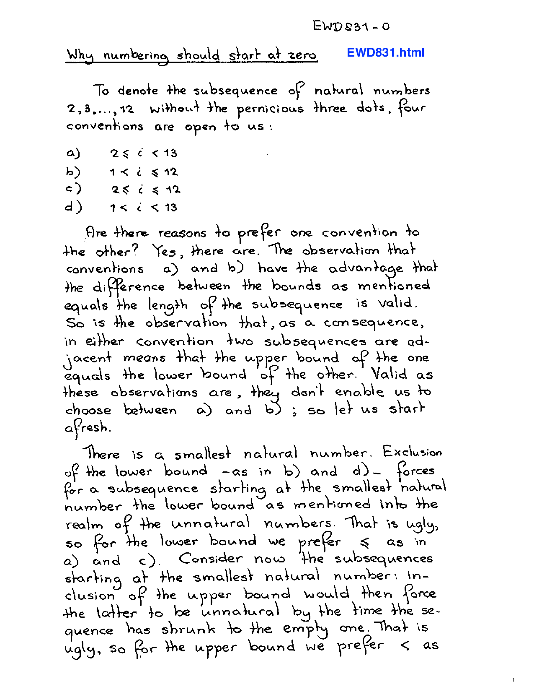
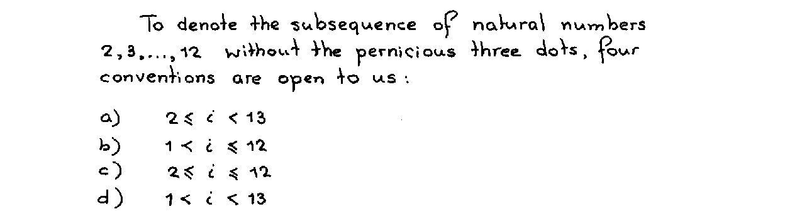
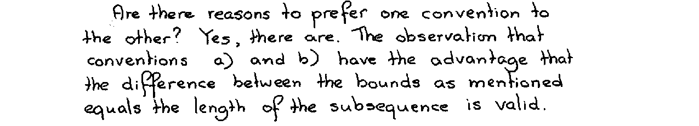
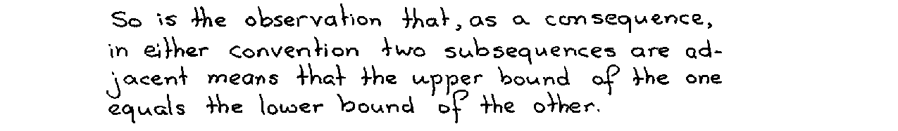
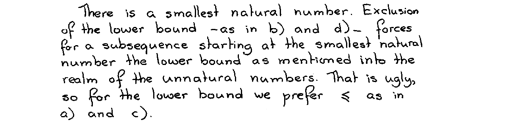
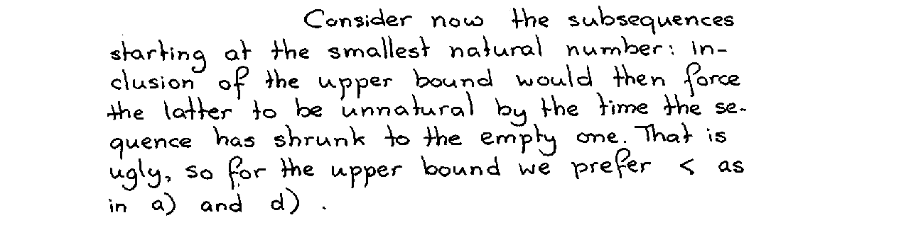
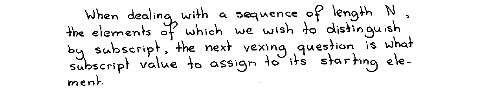
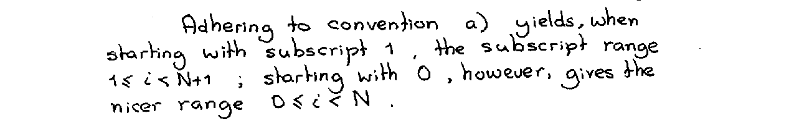
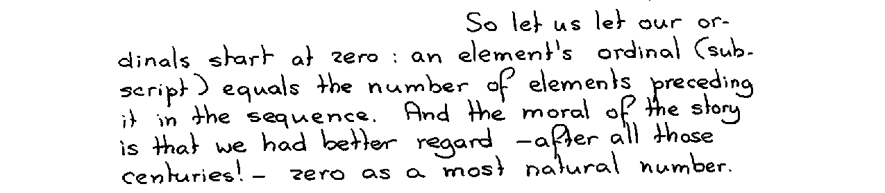

## Introduction

[Edsger W. Dijkstra][] wrote a [famous note][note-pdf] titled “Why numbering should start at zero” This three-page handwritten document is often cited in discussions about why indexing in programming languages should start at zero. While his reasoning is relatively straightforward, the document lacks the structure and examples needed to fully grasp it—at least for me—without resorting to pen and paper. As a result, I decided to read it thoroughly and unpack his reasoning into explicit arguments, expressed in my own words and illustrated with examples.

<figure>
  
  <figcaption>First page of Dijkstra's note</figcaption>
</figure>

The argument is built in two steps: first, by defining a preferred way to [denote subsequences of natural numbers][], and then by using this result to make the case for [subscripting sequences][], allowing him to conclude that numbering should start at zero.

[denote subsequences of natural numbers]: #denoting-subsequences-of-natural-numbers
[subscripting sequences]: #subscripting-sequences

## Denoting subsequences of natural numbers

The note begins by specifying the problem of denoting subsequences of natural numbers:

<figure>
  
</figure>

The [natural numbers][] are the first numbers we learn as children. We use them constantly to count things (cardinal) or to order things (ordinal). These numbers are [^1]:

$$0, 1, 2, 3, 4, …$$

A subsequence of these natural numbers is a sequence of consecutive numbers within the range, with a defined beginning and end. For instance, consider the example given in the note, $2, 3, \dots, 12$, which expands to:

$$
2, 3, 4, 5, 6, 7, 8, 9, 10, 11, 12
$$

Instead of listing all the numbers exhaustively as shown above, or using the _pernicious three dots_ (sic), we can represent the sequence by defining its lower and upper bounds, such as:

$$
2 \leq i \leq 12
$$

There are two ways to compare values with the bounds: either inclusive, using “smaller _or equal to_” ($\leq$), or exclusive, using “_strictly_ smaller than” ($\lt$). Since we need to perform two comparisons, and each can use two operators, we end up with $2 \times 2 = 4$ possible notations:

- a) $2 \leq i \lt 13$
- b) $1 \lt i \leq 12$
- c) $2 \leq i \leq 12$
- d) $1 \lt i \lt 13$

Let’s explore Dijkstra’s four arguments that led him to define a preferred way of denoting subsequences.

### First argument

<figure>
  
</figure>

The first argument concerns the length of the subsequence. As we can see, the subsequence we are working with contains 11 numbers:

$$
\underbrace{2, 3, 4, 5, 6, 7, 8, 9, 10, 11, 12}_{\normalsize \text{11 numbers}}
$$

If we refer back to our previous notations, we can see that the difference between the upper and lower bounds in notations a) and b) equals the subsequence length:

- a) ${\bf\color{blue}2} \leq i \lt  {\bf\color{blue}13} \hspace{2em} \rightarrow \hspace{2em} 13 - 2 = {\bf\color{green}11}$ ✅
- b) ${\bf\color{blue}1} \lt  i \leq {\bf\color{blue}12} \hspace{2em} \rightarrow \hspace{2em} 12 - 1 = {\bf\color{green}11}$ ✅
- c) ${\bf\color{blue}2} \leq i \leq {\bf\color{blue}12} \hspace{2em} \rightarrow \hspace{2em} 12 - 2 = {\bf\color{red}10}$ ❌
- d) ${\bf\color{blue}1} \lt  i \lt  {\bf\color{blue}13} \hspace{2em} \rightarrow \hspace{2em} 13 - 1 = {\bf\color{red}12}$ ❌

### Second argument

<figure>
  
</figure>

The second argument concerns adjacent subsequences. Let’s split our initial subsequence into two:

$$
\underbrace{2, 3, 4, 5, 6, 7}\_{\normalsize \text{first}}, \underbrace{ 8, 9, 10, 11, 12}\_{\normalsize \text{second}}
$$

If we represent these two subsequences using the four notations, we can observe that for a) and b), the upper bound of the first subsequence matches the lower bound of the second subsequence.

- a) $\overbrace{2 \leq i \lt  {\bf\color{green}8}}^{\text{first}}$ ✅ $\overbrace{{\bf\color{green}8} \leq i \lt 13}^{\text{second}}$
- b) $1 \lt i \leq {\bf\color{green}7}$ ✅ ${\bf\color{green}7} \lt i \leq 12$
- c) $2 \leq i \leq {\bf\color{red}7}$ ❌ ${\bf\color{red}8} \leq i \leq 12$ 
- d) $1 \lt i \lt {\bf\color{red}8}$ ❌ ${\bf\color{red}7} \lt i \lt 13$

This is a nice property that lets us easily split a subsequence at any point, or easily identify subsequences that can be merged if they have matching bounds:

$$
\underbrace{{\bf\color{blue}2} \leq i \lt {\bf\color{magenta}8} \hspace{0.5em}, \hspace{1em} {\bf\color{magenta}8} \leq i \lt {\bf\color{blue}13}}_{\normalsize {\bf\color{blue}2} \leq i \lt {\bf\color{blue}13}}
$$

### Third argument

<figure>
  
</figure>

The third argument states that there is a smallest natural number, which in our case is zero [^2]. If we want to represent the subsequence $0, 1, 2, 3$, notations b) and d), with an exclusive lower bound, would require us to use the _unnatural_ number $-1$ to define it:

- a) ✅ ${\bf\color{green}\hspace{0.8em}0} \leq i \lt 4$
- b) ❌ ${\bf\color{red}-1} \lt i \leq 3$
- c) ✅ ${\bf\color{green}\hspace{0.8em}0} \leq i \leq 3$
- d) ❌ ${\bf\color{red}-1} \lt i \lt 4$

### Fourth argument

<figure>
  
</figure>

The fourth argument is a bit more subtle. Let’s say we want to iterate over the subsequences of `0, 1, 2` using an algorithm that removes one element at a time from the larger side. Each step reduces the sequence by one element, like this:

0. `[0, 1, 2]`
1. `[0, 1]`
2. `[0]`
3. `[]`

If we use notation a) to denote each step, we obtain:

0. $0 \leq i \lt 3$
1. $0 \leq i \lt 2$
2. $0 \leq i \lt 1$

The issue arises when reaching the last step with the empty sequence. Representing it with an inclusive upper bound would—just like in the previous argument—require using the unnatural number `-1`:

- a) $\hspace{0.8em}0 \leq i \lt {\bf\color{green}\hspace{0.8em}0}$ ✅
- b) $-1 \lt i \leq {\bf\color{red}-1}$ ❌
- c) $\hspace{0.8em}0 \leq i \leq {\bf\color{red}-1}$ ❌
- d) $-1 \lt i \lt {\bf\color{green}\hspace{0.8em}0}$ ✅

### The convention `a)` has to be preferred

<figure>
  
</figure>

Dijkstra concludes the first part about the denotation of subsequences by stating that a) should be the preferred convention for denoting subsequences. Indeed, the only notation that successfully passes the 4 arguments is notation a).

$${\small\text{Preferred denotation of a subsequence:}} \hspace{1em} x \leq i \lt y \hspace{2em} {\footnotesize\square}$$

## Subscripting sequences

The second part of his argument tackles the question of why numbering should start at zero. He begins by formally stating the following question:

<figure>
  
</figure>

This means that for a given sequence of length $N$, such as:

$$
\underbrace{2, 3, 4, 5, 6}_{\normalsize \text{N = 5}}
$$

If we want to use subscript notation $x_{i}$ for each value, what subscript value $i$ should we pick for the first element? There are two meaningful possibilities: starting at either 0 or 1.

$$
x_{0}, x_{1}, x_{2}, x_{3}, x_{4}
\\\\
\text{or}
\\\\
x_{1}, x_{2}, x_{3}, x_{4}, x_{5}
$$

Side note: subscripting elements relates to enumerating them—i.e the zeroth, the first, the second, etc.—so the subscripts are, therefore, ordinal numbers.

### The argument

<figure>
  
</figure>

If we use the result obtained in the first section of this article, which states that the notation $x \leq i \lt y$ is to be preferred, it follows that starting at subscript 1 sets the upper bound to $N + 1$. Returning to our previous example, it gives us:

$$
\overbrace{x_{1}, x_{2}, x_{3}, x_{4}, x_{5}}^{\text{\scriptsize{\color{blue}N} elements}} = x_{\underbrace{\small{i}}_{\mathclap{\scriptsize{1\leq i \lt {\bf\color{red}N+1}}}}}
$$

While starting at subscript $0$, the range ends at $N$:

$$
\overbrace{x_{0}, x_{1}, x_{2}, x_{3}, x_{4}}^{\text{\scriptsize{\color{blue}N} elements}}  = x_{\underbrace{\small{i}}_{\mathclap{\scriptsize{0\leq i \lt {\bf\color{green}N}}}}}
$$

According to Dijkstra, the latter approach is _nicer_ (sic) because a sequence of length $N$ has subscripts in the range $0 \leq i \lt N$, with no extra offset required.

### Numbering should start at zero

<figure>
  
</figure>

Dijkstra concludes his argument by stating that ordinal numbering should therefore start at subscript zero, and, as a moral of the story, that zero is the most natural number.

$$
\overbrace{x_{0}, x_{1}, x_{2}, x_{3}, x_{4}}^{\text{\scriptsize{\color{blue}N} elements}}  = x_{\underbrace{\small{i}}_{\mathclap{\scriptsize{{\bf\color{green}0}\leq i \lt {\bf\color{blue}N}}}}}
\hspace{2em} \Rightarrow \hspace{1em} \text{numbering should start at zero}
\hspace{2em} {\footnotesize\blacksquare}
$$

## Conclusion

This concludes the unpacking of Dijkstra's note on “Why numbering should start at zero”. You can find more information and discussion about this topic on Wikipedia's article [Zero-based numbering][].

Dijkstra’s note also contains two side remarks on programming languages, and concludes with the context that motivated him to write it. These are not included here, but feel free to read the [entire note][note-pdf] if you are curious.

<!-- Footnotes -->

[^1]: Whether natural numbers are considered to start at $0$ or $1$ does not affect Dijkstra's arguments.
[^2]: I assume that natural numbers start at $0$. The argument would also hold true if we consider $1$ as the first natural number; Indeed, if $0$ is not part of the natural numbers, then to represent a sequence starting at $1$, we would need to use the number $0$, which is not included in the definition of natural numbers.

<!-- References -->

[Edsger W. Dijkstra]: https://en.wikipedia.org/wiki/Edsger_W._Dijkstra
[note-pdf]: https://www.cs.utexas.edu/~EWD/ewd08xx/EWD831.PDF
[natural numbers]: https://en.wikipedia.org/wiki/Natural_number
[Zero-based numbering]: https://en.wikipedia.org/wiki/Zero-based_numbering
